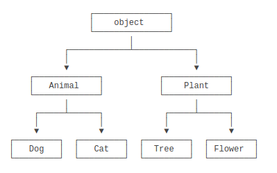
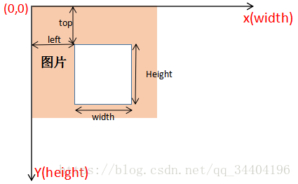

# class

## class and instance

    面向对象最重要的概念就是类（Class）和实例（Instance），必须牢记类是抽象的模板，比如Student类，
    而实例是根据类创建出来的一个个具体的“对象”，每个对象都拥有相同的方法，但各自的数据可能不同。
    仍以Student类为例，在Python中，定义类是通过class关键字：
    class Student(object):
         pass
    class后面紧接着是类名，即Student，类名通常是大写开头的单词，紧接着是(object)，表示该类是从哪个类继承下来的，
    继承的概念我们后面再讲，通常，如果没有合适的继承类，就使用object类，这是所有类最终都会继承的类。
    定义好了Student类，就可以根据Student类创建出Student的实例，创建实例是通过类名+()实现的：
    Nana=Student()
    
    可以自由的跟实例变量绑定属性,比如绑定个name 属性
    Nana.name='nana'
    
    由于类可以起到模板的作用，因此，可以在创建实例的时候，把一些我们认为必须绑定的属性强制填写进去。
    通过定义一个特殊的__init__方法，在创建实例的时候，就把name，score等属性绑上去：
    class Student(object):
        def __init__(self, name, score):
            self.name = name
            self.score = score
    注意：特殊方法“__init__”前后分别有两个下划线！！！
    
    注意到__init__方法的第一个参数永远是self，表示创建的实例本身，因此，在__init__方法内部，就可以把各种属性绑定到self，因为self就指向创建的实例本身。
    有了__init__方法，在创建实例的时候，就不能传入空的参数了，必须传入与__init__方法匹配的参数，但self不需要传，Python解释器自己会把实例变量传进去：
    和普通的函数相比，在类中定义的函数只有一点不同，就是第一个参数永远是实例变量self，并且，调用时，不用传递该参数。
    除此之外，类的方法和普通函数没有什么区别，所以，你仍然可以用默认参数、可变参数、关键字参数和命名关键字参数。
    
## 数据封装
    面向对象编程的一个重要特点就是数据封装。在上面的Student类中，每个实例就拥有各自的name和score这些数据。
    我们可以通过函数来访问这些数据，比如打印一个学生的成绩：
    >>> def print_score(std):
    ...     print('%s: %s' % (std.name, std.score))
    ...
    >>> print_score(bart)
    Bart Simpson: 59
    
    但是，既然Student实例本身就拥有这些数据，要访问这些数据，就没有必要从外面的函数去访问，可以直接在Student类的内部定义访问数据的函数，
    这样，就把“数据”给封装起来了。这些封装数据的函数是和Student类本身是关联起来的，我们称之为类的方法：
    class Student(object):

    def __init__(self, name, score):
        self.name = name
        self.score = score

    def print_score(self):
        print('%s: %s' % (self.name, self.score))
        
    要定义一个方法，除了第一个参数是self外，其他和普通函数一样。要调用一个方法，只需要在实例变量上直接调用，除了self不用传递，其他参数正常传入：
    >>> bart.print_score()
    Bart Simpson: 59   
     
    这样一来，我们从外部看Student类，就只需要知道，创建实例需要给出name和score，而如何打印，都是在Student类的内部定义的，
    这些数据和逻辑被“封装”起来了，调用很容易，但却不用知道内部实现的细节。

    class Student(object):
    ...

    def get_grade(self):
        if self.score >= 90:
            return 'A'
        elif self.score >= 60:
            return 'B'
        else:
            return 'C'
            
    小结:
    类是创建实例的模板，而实例则是一个一个具体的对象，各个实例拥有的数据都互相独立，互不影响；

    方法就是与实例绑定的函数，和普通函数不同，方法可以直接访问实例的数据；
    
    通过在实例上调用方法，我们就直接操作了对象内部的数据，但无需知道方法内部的实现细节。
    
    和静态语言不同，Python允许对实例变量绑定任何数据，也就是说，对于两个实例变量，虽然它们都是同一个类的不同实例，但拥有的变量名称都可能不同
## 访问限制

## 继承和多态
 

封装的另一个好处是可以给Student类增加新的方法，比如get_grade：

# pygame 中 rect
[rect](https://blog.csdn.net/YZXnuaa/article/details/79011795)

   
    (x,y) 是左上角坐标
    (left,top,width,height)
        x,y
        top, left, bottom, right
        topleft, bottomleft, topright, bottomright
        midtop, midleft, midbottom, midright
        center, centerx, centery
        size, width, height
        w,h

# sprite & sprite group 精灵和精灵组
为了简化开发步骤，pygame 提供了两个类
1. pygame.sprite.Sprite —— 存储 图像数据 image 和 位置 rect 的 对象

    在游戏开发中，通常把 显示图像的对象 叫做精灵 Sprite
      
    精灵 需要 有 两个重要的属性
      
    image 要显示的图像
      
    rect 图像要显示在屏幕的位置

    默认的 update() 方法什么事情也没做
    
    子类可以重写此方法，在每次刷新屏幕时，更新精灵位置
    
    注意：pygame.sprite.Sprite 并没有提供 image 和 rect 两个属性
    
    需要程序员从 pygame.sprite.Sprite 派生子类
    
    并在 **子类** 的 _初始化方法_ 中，设置 image 和 rect 属性
 2. 精灵组
    
    一个 精灵组 可以包含多个 精灵 对象

    调用 精灵组 对象的 update() 方法
    
    可以 自动 调用 组内每一个精灵 的 update() 方法
    
    调用 精灵组 对象的 draw(屏幕对象) 方法
    
    可以将 组内每一个精灵 的 image 绘制在 rect 位置

# 事件监听

    事件 event
    
    就是游戏启动后，用户针对游戏所做的操作
    
    例如：点击关闭按钮，点击鼠标，按下键盘...
    
    监听
    
    在 游戏循环 中，判断用户 具体的操作
    
    只有 捕获 到用户具体的操作，才能有针对性的做出响应
    
    代码实现
    
    pygame 中通过 pygame.event.get() 可以获得 用户当前所做动作 的 事件列表
    
    用户可以同一时间做很多事情
